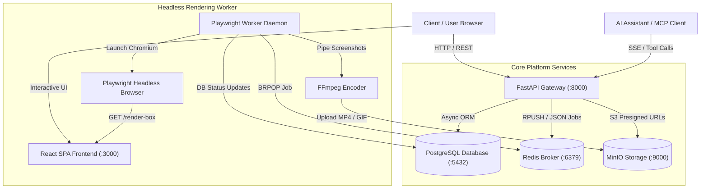
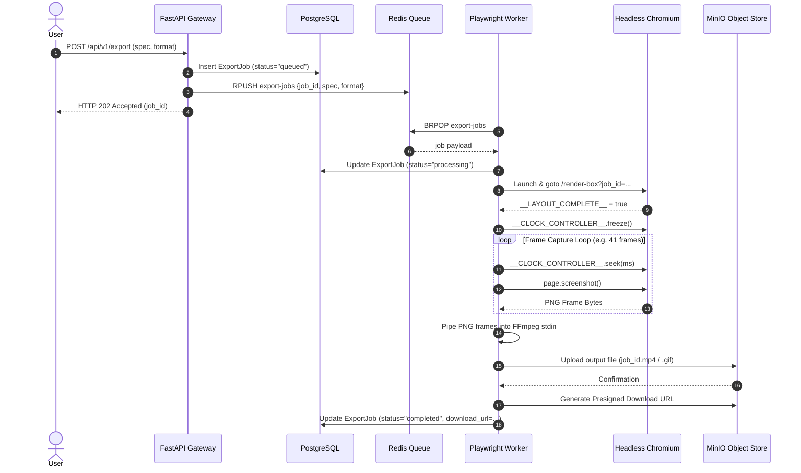

# FlowDraft Architecture & System Topology

FlowDraft is built as a decoupled, multi-tier microservices application designed for zero-stutter frame capture and high-throughput technical diagram rendering. This document details the architectural design, component responsibilities, data flow, and job execution lifecycle.

---

## 1. High-Level System Architecture

---

## 2. Six Core Service Tiers

### 1. Frontend SPA (React + Vite + TypeScript)
- **Interactive Editing**: Provides an interactive canvas using **XYFlow (React Flow)**.
- **Off-Thread Layout Engine**: Offloads CPU-intensive graph collision and hierarchy layout to a Web Worker running **ELKjs**.
- **Animation Pipeline**: Uses **GSAP (GreenSock Animation Platform)** with `MotionPathPlugin` to animate flow pulses along connection paths.
- **Isolated Frame Capture Route (`/render-box`)**: Exposes a clean, read-only route stripped of toolbars, handles, and grid lines. Exposes a global window object `window.__CLOCK_CONTROLLER__` for frame-by-frame timeline manipulation.

### 2. API Gateway (FastAPI)
- **REST Endpoints**: Serves user authentication, diagram CRUD operations, export job queueing, and health diagnostics.
- **Exception Handler**: Captures `SpecError` exceptions from `scripts.flowdraft.schema` and translates them into HTTP 400 Bad Request responses containing structural error paths.
- **Security & Authorization**: Enforces JWT bearer token authentication and CORS policies.
- **MCP Server Mount**: Integrates FastMCP with Server-Sent Events (SSE) at `/api/v1/mcp` and `/api/mcp`.

### 3. Database Layer (PostgreSQL)
- Built on SQLAlchemy 2.0 with `asyncpg` driver.
- Manages three primary entities:
  - `User`: Accounts, hashed credentials, activation state.
  - `Diagram`: Canvas specifications stored as JSON, metadata, user ownership.
  - `ExportJob`: Asynchronous render task tracking (`queued`, `processing`, `completed`, `failed`), format preferences (`mp4`, `gif`, `png`), error logs, and MinIO presigned download URLs.

### 4. Asynchronous Job Broker (Redis)
- Decouples HTTP API response time from heavy media processing.
- Uses a Redis list `export-jobs`.
- Incoming export requests append JSON job payloads (`job_id`, `spec`, `format`).

### 5. MinIO Object Storage
- S3-compatible object storage server hosting the `exports` bucket.
- Stores compiled MP4, GIF, and PNG output artifacts.
- Generates secure presigned download URLs with configurable TTL expiration.

### 6. Headless Render Worker (Playwright + FFmpeg)
- Python daemon running an asynchronous loop (`worker_loop`).
- Polls Redis using `BRPOP` and processes jobs concurrently (up to 10 workers).
- Spawns headless Chromium via Playwright, navigates to `/render-box`, waits for `window.__LAYOUT_COMPLETE__`, freezes GSAP ticker via `window.__CLOCK_CONTROLLER__.freeze()`, and steps through frames deterministically.
- Captures PNG screenshots and pipes them into `ffmpeg` via `stdin` (`image2pipe`).

---

## 3. Asynchronous Video Export Lifecycle

---

## 4. Model Context Protocol (MCP) Architecture

FlowDraft embeds a Model Context Protocol server exposing fast diagram manipulation and compilation tools directly to AI assistants.

- **Transport**: Server-Sent Events (SSE) via FastMCP (`SseServerTransport`).
- **Auth Middleware**: Inspects `X-MCP-API-Key` header or `api_key` query parameter against `settings.MCP_API_KEYS`.
- **System Provisioning**: Automatically provisions a default user `mcp_system_user@flowdraft.local` for system-originated exports.
- **Available Tools**:
  - `compile_diagram`: Validates JSON spec against FlowDraft V2 schema.
  - `trigger_export`: Enqueues an export job in Redis and returns the `job_id`.
  - `get_export_status`: Polls status and returns presigned download URL when complete.
